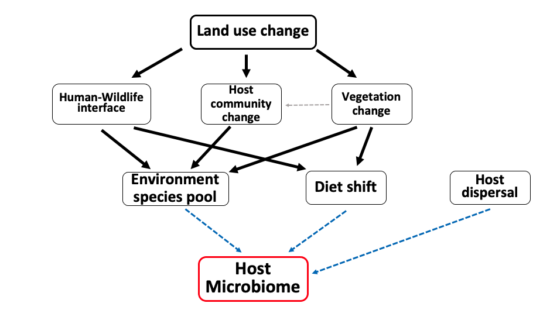

```{r setup, include=FALSE}
knitr::opts_chunk$set(results = "asis", message=FALSE, warning=FALSE, cache=TRUE, eval = TRUE, dev = c('png'), out.width = '100%', out.height='40%')
```


```{r load libraries, echo=FALSE, message=FALSE, warning=FALSE}
library(tidyverse)
library(magrittr)
library(ggplot2)
library(vegan)
library(igraph)
library(reshape2)
library(infomapecology)
library(aricode)

rm(list=ls())
```

```{r}
source("modularity_analysis_functions.R", local = knitr::knit_global())
```

```{r, microbiome data}
# reading the microbiome data
# working only with Rattus from the three villages
# removing the 'village' grid from the analysis

data_asv <- read_csv("../data/data_processed/microbiome/data_asv_rra0.01_th1000.csv") %>% 
  filter(host_species == "Rattus rattus" & grid!="village")

# # ASVs taxonomy
# asv_taxa <- read_delim("../data/data_raw/data_microbiome/ASVs_all_merged_taxonomy.tsv") %>%
#   select(ASV, Family)
# data_asv %<>% left_join(asv_taxa, by=c("asv_ID"="ASV"))
# 
# data_asv_family <- data_asv %>%
#   group_by(host_ID, village, host_species, grid, season,total_reads, Family) %>%
#   summarise(reads = sum(reads)) %>%
#   rename(asv_ID = Family) %>%
#   filter(!(is.na(asv_ID)))
# data_asv <- data_asv_family
```

```{r, main analysis, include=FALSE}
# first of all, run this chunk of code.
# this code does all the modularity analysis using the functions in "modularity_analysis_functions".
# There is a loop runs for the three villages, and all the analysis is done separately for each village.
# the output of the code is variables holding the final results figures (the output of the functions used)


# setting thresholds for core
core_seq <- seq(1,2, by=2)

village_names <- unique(data_asv$village)
nmi_observed_three_villages <- NULL
nmi_diff_core_three_villages <- NULL
modules_similarity_three_villages <- NULL
asv_degree_distribution_three_villages <- NULL
modules_three_villages <- NULL
modules_size_three_villages <- NULL
modules_grid_three_villages <- NULL


# for loop for three villages
for (v in village_names) {
  
  data_asv_village <- data_asv %>% 
    filter(village == v)
  
  # calculating ASVs degree 
  asv_degree <- data_asv_village %>% 
    group_by(asv_ID) %>% 
    summarise(n = n_distinct(host_ID)) %>% 
    rename(asv_degree = n)
  data_asv_village %<>% left_join(asv_degree, by="asv_ID")
  
  ##### observed network
  # finding modules
  modules_observed <- fun_modularity_analysis(data_asv_village)
  
  # calculating similarity in modules between grids
  modules_similarity <- fun_modules_similarity(modules_observed) %>% 
    mutate(village = v)
  # saving results in one table
  modules_similarity_three_villages <- rbind(modules_similarity_three_villages, modules_similarity)
  
  # ASVs degree distribution
  asv_degree_distribution <- fun_asv_degree_distribution(data_asv_village)
  asv_degree_distribution_three_villages <- append(asv_degree_distribution_three_villages, asv_degree_distribution)
  
  # figure of modules 
  modules <- fun_modules(modules_observed)
  modules_three_villages <- append(modules_three_villages, modules)
  
  # modules size
  modules_size <- fun_module_size(modules_observed)
  modules_size_three_villages <- append(modules_size_three_villages, modules_size)
  
  # Number of land uses per module
  modules_grid <- fun_module_grid(modules_observed)
  modules_grid_three_villages <- append(modules_grid_three_villages, modules_grid)
  
  # calculating NMI
  nmi_observed <- fun_nmi_calc(modules_observed, TRUE)
  # saving results in one list
  nmi_observed_three_villages <- append(nmi_observed_three_villages, nmi_observed)
  
  ##### NMI for different values of core microbiome
  # calling the function
  nmi_diff_core <- fun_modularity_diff_core(data_asv_village, nmi_observed, core_seq)
  # saving results in one list
  nmi_diff_core_three_villages <- append(nmi_diff_core_three_villages, nmi_diff_core)
  
}
```
# Modularity analysis

## Network exploration {.tabset}


```{r, network_exploration}
# loop for three villages
for (i in 1:3) {
  
  cat('###',village_names[i],'{.tabset}','\n','\n')
  
  cat('#### ASVs degree distribution','\n')
  
  
  print(asv_degree_distribution_three_villages[[i]])
  cat('\n','\n')
  
  
  cat('#### Modules','\n')
  cat('The color indicates number of host individuals in the module / total number of hosts in the whole grid [%]','\n','\n')
  
  print(modules_three_villages[[i]])
  cat('\n','\n')
  
  cat('#### Modules size','\n')
  print(modules_size_three_villages[[i]])
  cat('\n','\n')
  
  cat('#### No. of land uses','\n')
  print(modules_grid_three_villages[[i]])
  cat('\n','\n')
  
}

```

## Normalized Mutual Information (NMI) {.tabset}

```{r, nmi}
# loop for three villages
for (j in 1:3) {
  
  cat('###',village_names[j],'{.tabset}','\n','\n')
  
  cat('#### NMI','\n')
  print(nmi_observed_three_villages[[j*2]])
  cat('\n','\n')
  
  cat('#### NMI for core/non-core','\n')
  print(nmi_diff_core_three_villages[[j]])
  cat('\n','\n')
}

```

# Hypotheses testing

```{r}
# reading grid similarity results
grids_similarity_attr <- read_csv("../data/data_processed/village_summary2.csv")

# combining the variables
final_data <- modules_similarity_three_villages %>% 
  left_join(grids_similarity_attr, by=c("village","grid1","grid2")) %>% 
  filter(grid1!="village") # removing the village grid

# saving the final table
#write_csv(final_data, "data/data_processed/final_modularity_data.csv")
```


I explore 4 non-mutual exclusive hypotheses for why land use affects the network's modular structure:

 1. **Neutral process**  - stochastic processes cause to a variation in the microbiome and modules across grids. Therefore, no variable explains modules similarity.
 2. **environmental filtering** - grid attributes (vegetation) induce selective pressure. Therefore, grids with similar vegetation attributes have higher modules similarity.
 3. **Rattus movement** - Rattus individuals can move between grids. Therefore, closer grids have higher modules similarity.
 4. **Microbes reservoir** - microbes of other host species constitute a microbes reservoir in the grid. Therefore, grids with similart small mammals communities have higher modules similarity.


## The model

I used a linear mixed model (LMM) with 'modules similarity' as response variable and (1) 'grid attributes similarity, (2) 'grids distance', and (3) 'small mammals community similarity' as predictors. I added the 'village' as random factor.\

```{r, the_model, echo=TRUE}
# setting the full model
library(nlme)
full_model <- lme(module_similarity ~ grid_attr + grid_dist + sm_community, random=~1|village, data = final_data, method = "ML", na.action = na.fail)
# r.squaredGLMM(full_model)
```

## Correlations between variables {.tabset}

### Correlations

```{r, variables_correlation}
# correlations between variables
library(psych)
print(psych::pairs.panels(final_data %>% filter(grid1!="village") %>%  select(-village,-grid1,-grid2, -module_similarity), ellipses = F, lm = T))
```

### VIF

Variance Inflation Factor (VIF) - is a measure used in regression analysis to assess multicollinearity among predictor variables.\
VIF quantifies how much the variance of an estimated regression coefficient is increased due to multicollinearity. It is calculated for each predictor variable by regressing it against all other predictor variables in the model.\
A VIF value of 1 indicates no multicollinearity, while higher values indicate increasing levels of multicollinearity. **A common rule of thumb is that a VIF > 10 indicates problematic multicollinearity**.\

```{r, vif}
# checking VIF
# as a rule of thumb, VIF< 10 for a variable is fine
library(car)
print(knitr::kable(car::vif(full_model)))
```

## Linear regression {.tabset}

### Grid attributes

```{r, regression_attributes}
# grid attributes
final_data %>% 
  ggplot(aes(y=module_similarity, x=grid_attr, color=village)) +
  geom_point(alpha = 0.8) +
  geom_smooth(method = "glm", se=F, method.args = list(family = "gaussian")) +
  theme_bw() +
  theme(axis.text = element_text(size = 10, color = 'black'), title = element_text(size = 14), strip.text.x = element_text(size=12)) +
  labs(x = "Grids Attributes Disimilarity [Euclidean]", y = "Modules Similarity [Bray-Curtis]")
```

### Distance

```{r, regression_distcance}
# grid distance
final_data %>% 
  ggplot(aes(y=module_similarity, x=grid_dist, color=village)) +
  geom_point(alpha = 0.8) +
  geom_smooth(method = "glm", se=F, method.args = list(family = "gaussian")) +
  theme_bw() +
  theme(axis.text = element_text(size = 10, color = 'black'), title = element_text(size = 14), strip.text.x = element_text(size=12)) +
  labs(x = "Distance Between Grids [Log(m)]", y = "Modules Similarity [Bray-Curtis]")
```

### Small mammals community

```{r, regression_sm_community}
# small mammals similarity
final_data %>% 
  ggplot(aes(y=module_similarity, x=sm_community, color=village)) +
  geom_point(alpha = 0.8) +
  geom_smooth(method = "glm", se=F, method.args = list(family = "gaussian")) +
  theme_bw() +
  theme(axis.text = element_text(size = 10, color = 'black'), title = element_text(size = 14), strip.text.x = element_text(size=12)) +
  labs(x = "Small Mammals Disimilarity [Bray-Curtis]", y = "Modules Similarity [Bray-Curtis]")
```


## Model selection {.tabset}

```{r, model_selection}
# AIC 
library(MuMIn)
dredge_modules_similarity <- MuMIn::dredge(full_model)
```

### Table

Presenting only the best models: delta AICc <= 5\

```{r, aic_table}
# The best models: delta <= 5
results_modules_similarity <- subset(dredge_modules_similarity, delta <= 5 | df == 3 | df == max(df), recalc.weights = FALSE)
row.names(results_modules_similarity) <- c(1:(nrow(results_modules_similarity)))
 

# arranging the final table
aic_results_final <- as.data.frame(results_modules_similarity) %>% 
  select(-df, -logLik) %>% 
  dplyr::rename(intercept='(Intercept)', grid_attributes=grid_attr, grid_distance=grid_dist, sm_similarity=sm_community) %>% 
  mutate(across(everything()), round(.,3))
print(knitr::kable(aic_results_final))
```


### Variables Importance

```{r, aic_importance}
imp <- as.data.frame(MuMIn::sw(dredge_modules_similarity))
colnames(imp) <- "importance"
var_names <- rownames(imp)
imp_values <- as.vector(imp[[1]])

# Plotting
g <- imp %>% 
  rownames_to_column("variable") %>% 
  mutate(variable = factor(variable)) %>% 
  ggplot(aes(x=reorder(variable,-importance), y=importance)) +
    geom_bar(stat="identity", fill = "#e5e5e5", color="#8b8c89") +
    theme_bw() +
    scale_y_continuous(limits = c(0, 1)) +
    theme(axis.text = element_text(size = 14, color = 'black'), title = element_text(size = 20), strip.text.x = element_text(size=12), legend.position="none",
          panel.grid.major = element_blank(),
    panel.grid.minor = element_blank()) +
  geom_text(aes(label=round(importance,2)), vjust=-0.5) +
 # annotate(geom = "text", x=imp$variable, y=imp$importance, label=imp$importance) +
    labs(x="", y="Variable's Importamce")
print(g)

```


